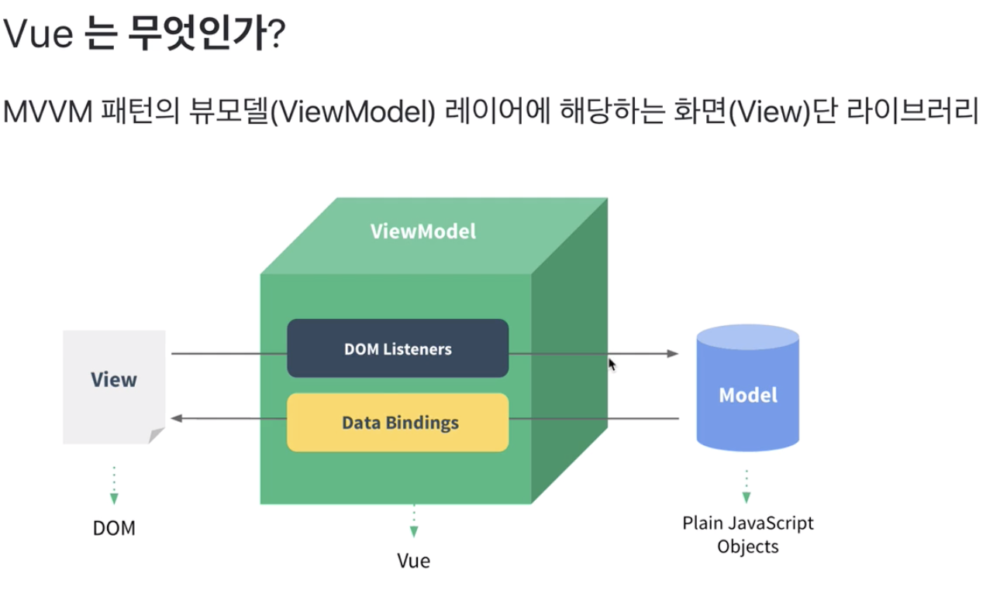
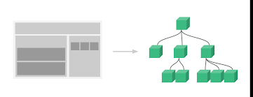
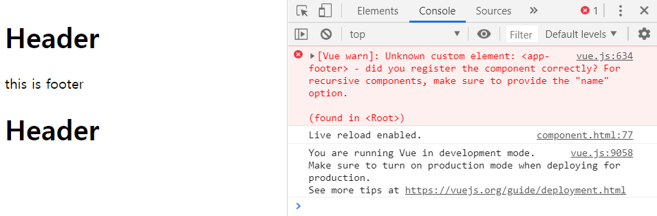
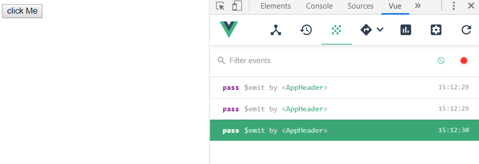
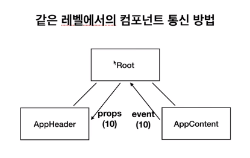
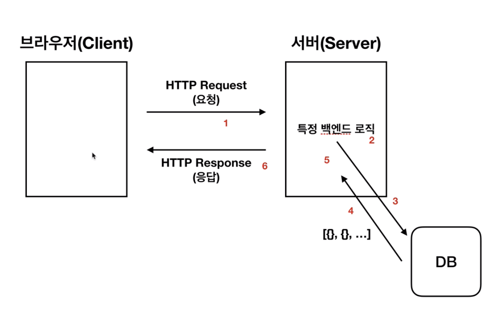

# Vue study

## 0. 시작하기 전에..

1. visual studio code, google chrome, node.js, vue.js dev tools 설치하기
2. [강좌 깃 허브 주소](https://github.com/joshua1988/learn-vue-js)
3. 관련 자료 클론 받아서 공부해보자..

## 1. 자 이제 시작해보자

1. 플러그 인을 설치하자

   - 사각박스 우측 하단 클릭

   - \- Vetur

     \- Night Owl

     \- Material Icon Theme

     \- Live Server

     \- ESLint

     \- Prettier

     \- Auto Close Tag

     \- Atom Keymap

   - 컴포넌트와 이벤트 많이 다룰 예정이다.


## 2. 뷰는 무엇인가?

- 

- ! 치고 탭 누르면 html 자동으로 만들어진다.

- Div#app 치면 \<div id="app">\</div> 만들어진다.

- ```Html
  Object.defineProperty(대상 객체, 객체의 속성,{
    // ... 정의할 내용
  })
  ```

- ```Html
  <body>
      <div id="app"></div>

      <script>
          //console.log(div);
          var div = document.querySelector('#app');
          var str = 'hello world';
          div.innerHTML = str;

          str = 'hello world!!!';
          div.innerHTML = str;

      </script>
  </body>
  </html>
  ```
  이렇게 하면 값이 바뀔 때 마다 그대로 html 에 적용된다. 이걸 리액티비티라고 하고, 라이브러리가 감지하여 바로바로 적용시키는 것이 뷰의 특징이다.


  ```Html
   <body>
      <div id="app"></div>

      <script>
          var div = document.querySelector('#app');
          var viewModel={};
          // 3. 즉시 실행. 코드를 보호한다.
          (function(){
              function init(){
                  Object.defineProperty(viewModel,'str',{
                      // 속성에 접근했을 때의 동작을 정의한다.
                      get:function(){
                          console.log('접근');
                      },
                      // 속성에 값을 할당했을 때의 동작을 정의한다 - 데이터 바인딩
                      set:function(newValue){
                          console.log("할당",newValue);
                          render(newValue);
                      }
                  });
              }
              // 1. 랜더 함수를 만들어서 코드 쪼개기
              function render(value){
                  div.innerHTML = value;
              }
              // 2. 호출하기
              init();
          })();
      </script>

  </body>
  </html>
  ```

  mac : option + command + i  개발자 도구 띄우기

- 리엑티비티 : 데이터의 변화에 따라 화면이 바로바로 바뀌는 것.

- new Vue 를 인스턴스라고 한다.


## 뷰 인스턴스

- 필수로 생성해야 하는 단위이다. 

- el 이 꼭 있어야 뷰를 실행할 수 있다. 이게 있어야 div 안쪽의 태그의 모든 것들이 유효하다고 한다.

- ```Html
  <body>
      <div id="app"></div>

      <script src="https://cdn.jsdelivr.net/npm/vue/dist/vue.js"></script>
      <script>
          var vm = new Vue({
              // el이 있어야 뷰가 동작을 할 수 있다.
              el:'#app',
              data: {
                  message:'hi'
              }
          });
      </script>
      
  </body>
  </html>
  ```

- 생성자 함수 사용 설명서. 

- 인스턴스 재사용이 가능하게 된다. 쉽고 빠르고 좋다.

- ```html
  new Vue({
  	el: ,
  	template: ,
  	data: ,
  	methods: ,
  	...
  }
  ```

- ```html
  <body>
      <div id="app"></div>
      <script>
          // 객체를 통째로 넣어주는 것이 가독성이 좋다.
          // 객체 표기법으로 넣어주자.
          var vm = new Vue({
              el:'#app',
              data:{
                  message:'hi'
              },
              methods:{

              },
              created:{

              }
          });
      </script>
  </body>
  </html>
  ```

## 뷰 컴포넌트 

- 거의 다 컴포넌트 기반으로 코딩하고 있다.

- 영역별로 코드로 구분해서 관리한다. 

  - 재사용성 증가
  - 코드의 반복 줄이기.

- 컴포넌트간의 관계가 생긴다.

- 

- 컴포넌트를 등록할 수 있다.

- ```html
  <body>
      <div id="app">
          // 컴포넌트 등록하는 곳.
          <app-header></app-header>
          <app-content></app-content>
      </div>

      <script src="https://cdn.jsdelivr.net/npm/vue/dist/vue.js"></script>
      <script>
          // 전역 컴포턴트 - 쓸일 거의 없음. 하지만 구조상 쉽게 등록하는 방법을 배움
        	// 플러그인 등을 설치하고자 할때 씀.
          Vue.component('app-header',{
              template:'<h1>Header</h1>'
          });
          Vue.component('app-content',{
              template:'<p>content</p>'
          });
          // 인스턴스를 생성하면 기본적으로 root 컴포넌트가 된다.
          new Vue({
              el: '#app'
          });
      </script>

  </body>
  </html>
  ```

- 지역 컴포넌트 등록 방법

  ```html
  <body>
      <div id="app">
          <app-header></app-header>
          <app-content></app-content>
          <app-footer></app-footer>
      </div>

    	// vue를 실행하기 위해 필요한 cdn
      <script src="https://cdn.jsdelivr.net/npm/vue/dist/vue.js"></script>
      <script>
          Vue.component('app-header',{
              template:'<h1>Header</h1>'
          });
          Vue.component('app-content',{
              template:'<p>content</p>'
          });
          // 인스턴스를 생성하면 기본적으로 root 컴포넌트가 된다.
          new Vue({
              el: '#app',
              // 지역 컴포넌트를 등록해보자.
              components:{
                  //'키' : '밸류' 형태로 존재
                  // '컴포넌트 이름' : '컴포넌트 내용'
                  'app-footer':{
                      template:'<footer>this is footer</footer>'
                  }
              }
          });
      </script>

  </body>
  </html>
  ```

- 왜 지역과 전역을 나눴고, 서비스별 특징에 대해 배워보자.

  - 전역으로 사용되는 라이브러리 형태, **플러그인**에는 전역을 등록
  - 지역 컴포넌트는 실제 등록되는 서비스들의 요소가 들어가게 된다. 일반적으로는 지역을 사용한다.

  ```html
  <body>
      <div id="app">
          <app-header></app-header>
          <app-content></app-content>
          <app-footer></app-footer>
      </div>

      <script src="https://cdn.jsdelivr.net/npm/vue/dist/vue.js"></script>
      <script>
          // 전역 컴포넌트를 등록해보았음. 
          Vue.component('app-header',{
              template:'<h1>Header</h1>'
          });
          Vue.component('app-content',{
              template:'<p>content</p>'
          });
          // 인스턴스를 생성하면 기본적으로 root 컴포넌트가 된다.
          new Vue({
              el: '#app',
              // 지역 컴포넌트를 등록해보자.
              // 여러개가 들어가는 속성이기 때문에 s가 붙는다.
              components:{
                  //'키' : '밸류' 형태로 존재
                  // '컴포넌트 이름' : '컴포넌트 내용'
                  'app-footer':{
                      template:'<footer>this is footer</footer>'
                  }
              },
              // 이것도 s를 붙여준다.
              methods:{

              }
          });
      </script>

  </body>
  </html>
  ```

- 컴포넌트와 인스턴스간의 관계

  ```html
  <body>
      <div id="app">
          <app-header></app-header>
          <app-footer></app-footer>
      </div>
      <div id="app2">
          <app-header></app-header>
          <app-footer></app-footer>
      </div>

      <script src="https://cdn.jsdelivr.net/npm/vue/dist/vue.js"></script>
      <script>
          Vue.component('app-header',{
              template:'<h1>Header</h1>'
          });
          new Vue({
              el: '#app',
              components:{
                  'app-footer':{
                      template:'<footer>this is footer</footer>'
                  }
              },
              methods:{
              }
          });
          new Vue({
              // 지역 컴포넌트에 footer가 등록되어있지 않기 때문에 error 가 발생한다!
              el:'#app2'
          });
      </script>

  </body>
  </html>
  ```

  전역은 모든 인스턴스에 등록이 되어있다. 

  지역은 인스턴스마다 새로 생성을 해주어야 한다. 그래서 footer에서는 에러가 발생함을 볼 수 있다. 

  

  > 다음과 같이 footer가 나오지 않는 것을 볼 수 있다.
  >
  > 전역 컴포턴트와 달리 지역 컴포턴트는 모든 인스턴스에 등록되어있지 않다.

  ```html
  <body>
      <div id="app">
          <app-header></app-header>
          <app-footer></app-footer>
      </div>
      <div id="app2">
          <app-header></app-header>
          <app-footer></app-footer>
      </div>

      <script src="https://cdn.jsdelivr.net/npm/vue/dist/vue.js"></script>
      <script>
          // 전역 컴포넌트를 등록해보았음. 
          Vue.component('app-header',{
              template:'<h1>Header</h1>'
          });
    
          // 인스턴스를 생성하면 기본적으로 root 컴포넌트가 된다.
          new Vue({
              el: '#app',
              // 지역 컴포넌트를 등록해보자.
              // 여러개가 들어가는 속성이기 때문에 s가 붙는다.
              components:{
                  //'키' : '밸류' 형태로 존재
                  // '컴포넌트 이름' : '컴포넌트 내용'
                  'app-footer':{
                      template:'<footer>this is footer</footer>'
                  }
              },
              // 이것도 s를 붙여준다.
              methods:{

              }
          });

          new Vue({
              el:'#app2',
              components:{
                  // 이렇게 생성할때마다 컴포넌트를 등록해줘야 한다.
                  'app-footer':{
                      template:'<footer>this is footer</footer>'
                  }
              }
          });
      </script>

  </body>
  </html>
  ```

- 컴포넌트의 통신방식

  - 컴포넌트를 등록하면 서로 관계가 생긴다.
  - 관계에 대한 규칙이 존재한다.
  - 뷰 컴포넌트는 각각 고유한 데이터 유효범위를 갖는다. <u>프롭스와 이벤트</u>
  - 

- 컴포넌트 통신 규칙이 필요한 이유

  - 컴포턴트 통신 데이터 통신간 방향 규칙이 없다.
  - 이를 규칙화 해주는 것이 프롭스와 이벤트이다.
  - 데이터의 흐름을 추적할 수 있다. 
  - 아래에서 위로 이벤트가 올라가고 위에서 아래로 프롭스가 내려간다.

- 프롭스 기초

```html
    <body>
        <div id="app">
            <!--props 문법-->
            <!-- <app-header v-bind:프롭스 속성 이름="상위 컴포넌트의 데이터 이름"></app-header> -->
            <app-header v-bind:propsdata="message"></app-header>
            <app-header></app-header>
        </div>
    
        <script src="https://cdn.jsdelivr.net/npm/vue/dist/vue.js"></script>
    
        <script>
            var appHeader = {
                template:'<h1>header</h1>',
              	// 1. 프롭스 속성 이름을 먼저 정해주고,
                props:['propsdata']
            }
            new Vue({
                el:'#app',
                components:{
                    'app-header':appHeader
                },
                data:{
                  // 2. 상위 컴포넌트의 데이터 이름을 지정해준다.
                    message:'hi'
                }
            })
        </script>
    </body>
    </html>
```

- 프롭스 속성의 특징

  - 리엑티비티가 프롭스에도 반영이 된다. 위에서 내용을 고치면 **자식계층에서도 고쳐진다.**

  - 프롭스 실습

  - 전달된 값이 바로 반영되는 것을 리엑티비티라고 한다.

  - ```html
    <body>
        <div id="app">
            <!--props 문법-->
            <!-- <app-header v-bind:프롭스 속성 이름="상위 컴포넌트의 데이터 이름"></app-header> -->
            <app-header v-bind:propsdata="message"></app-header>
            <!--2. 내려온데이터는 어떤 변수를 가져올 것인가??-->
            <app-content v-bind:propsdata="number"></app-content>
        </div>

        <script src="https://cdn.jsdelivr.net/npm/vue/dist/vue.js"></script>

        <script>
            var appHeader = {
                //{{이걸 데이터 바인딩이라고 한다.}}
                template:'<h1>{{ propsdata }}</h1>',
                props:['propsdata']
            }
            var appContent = {
                template:"<h1>{{propsdata}}</h1>",
                // 1. 여기에다 변수를 먼저 등록한다.
                props:['propsdata']
            }
            new Vue({
                el:'#app',
                components:{
                    'app-header':appHeader,
                    'app-content':appContent
                },
                data:{
                  // 2. 상위 컴포넌트의 데이터 이름.
                    message:'hi',
                    number:10
                }
            })
        </script>
    </body>
    </html>
    ```

- 이벤트 emit

  - 아래에서 위로 정보 요청 신호를 보낼 때 쓴다.

  - ```html
    <body>
        <div id="app">
            <app-header></app-header>
        </div>
        <script src="https://cdn.jsdelivr.net/npm/vue/dist/vue.js"></script>
        <script>
            var appHeader = {
                // 이벤트 v-on:click="" 으로 정의하자.
                template:'<button v-on:click="passEvent">click Me</button>',
                methods:{
                    // 버튼을 클릭했을 때 발생하는 이벤트
                    passEvent: function(){
                        this.$emit('pass');
                    }
                }
            };
            new Vue({
                el:'#app',
                components:{
                    'app-header':appHeader
                }
            });
        </script>
    </body>
    </html>
    ```




클릭하면 이벤트가 발생한다. 이제 이걸 어떻게 활용할지 살펴보겠다.

동일 래밸간 컴포넌트 데이터 이동에 관한 공부 진행.

- ```html
  <body>
      <div id="app">
          <!-- <app-header v-on:하위 컴포넌트에서 발생한 이벤트 이름="상위 컴포넌트의 메서드 이름"></app-header> -->
          <app-header v-on:pass="logText"></app-header>
          <!-- 2. 상위 컴포턴트 호출 -->
          <app-content v-on:add_num="plusOne"></app-content>
          <!-- 4. 반영된거 뿌려주기 -->
          <p>{{num}}</p>
      </div>
      <script src="https://cdn.jsdelivr.net/npm/vue/dist/vue.js"></script>
      <script>
          var appHeader = {
              // 이벤트 v-on:click="" 으로 정의하자.
              template:'<button v-on:click="passEvent">click Me</button>',
              methods:{
                  passEvent: function(){
                      this.$emit('pass');
                  }
              }
          };
          var appContent={
              template:'<button v-on:click="addNumber">add</button>',
              methods:{
                  addNumber:function(){
                      //1. 새로운 사실 발견..! 함수를 카멜 표기법으로 하는것을 지원하지 않는다.
                      // $emit 하위에서 상위로 이벤트 발생 요청!
                      this.$emit('add_num');
                      // this.$emit('addNum');
                  }
              }
          };
          new Vue({
              el:'#app',
              components:{
                  'app-header':appHeader,
                  'app-content':appContent
              },
              methods:{
                  logText:function(){
                      console.log('hi');
                  },
                  // 3. 함수 실행
                  plusOne:function(){
                     this.num++;
                  }
              },
              data:{
                  num:10
              }
          });
      </script>
  </body>
  </html>
  ```

- 같은 컴포넌트 레밸 간의 통신 방법

- 

- 일단 emit으로 올린다.

- ```html
  <body>
      <div id="app">
          <app-header></app-header>
          <app-content></app-content>
      </div>

      <script src="https://cdn.jsdelivr.net/npm/vue/dist/vue.js"></script>
      <script>
          var appHeader={
              template:'<div>header</div>'
          }
          var appContent={
              template:'<div>content<button v-on:click="passNum">pass</button></div>',
              methods:{
                  passNum:function(){
                      this.$emit('pass',10);
                  }
              }
          }
          new Vue({
              el:'#app',
              components:{
                  'app-header':appHeader,
                  'app-content':appContent
              },
              data:{
                  num: 0
              }
          })
      </script>
  </body>
  </html>
  ```

- props로 내린다.

  - 이벤트가 잘 발생되었는지 확인한다.
  - 속성 잘 바뀌었나.
  - props 잘 넘어갔는지 확인한다.

- ```html
  <!DOCTYPE html>
  <html lang="en">
  <head>
      <meta charset="UTF-8">
      <meta name="viewport" content="width=device-width, initial-scale=1.0">
      <meta http-equiv="X-UA-Compatible" content="ie=edge">
      <title>Document</title>
  </head>
  <body>
      <div id="app">
          <!-- 여기서 데이터를 props로 받는다 -->
          <app-header v-bind:propsdata="num"></app-header>
          <!-- 여기로 넘겨준다. -->
          <app-content v-on:pass="deliverNum"></app-content>
      </div>

      <script src="https://cdn.jsdelivr.net/npm/vue/dist/vue.js"></script>
      <script>
          var appHeader={
              template:'<div>header</div>',
              //props로 받는다.
              props:['propsdata']
          }
          var appContent={
              template:'<div>content<button v-on:click="passNum">pass</button></div>',
              methods:{
                  passNum:function(){
                      // 올려준다.
                      this.$emit('pass',10);
                  }
              }
          }
          new Vue({
              el:'#app',
              components:{
                  'app-header':appHeader,
                  'app-content':appContent
              },
              data:{
                  num: 0
              },
              methods:{
                  // 받아온 메서드를 바꿔준다.
                  deliverNum:function(value){
                      this.num=value;
                  }
              }
          })
      </script>
  </body>
  </html>
  ```

- 뷰 라우터 설치하기

  - Script:src 하고 탭 누르면 \<script src="">\</script> 나온다.. 대박

  - ```Html
    <!DOCTYPE html>
    <html lang="en">
    <head>
        <meta charset="UTF-8">
        <meta name="viewport" content="width=device-width, initial-scale=1.0">
        <meta http-equiv="X-UA-Compatible" content="ie=edge">
        <title>Document</title>
    </head>
    <body>
        <app id="div"></app>

        <!-- 순서도 중요하다.. 먼저 뷰를 띄워놓고 그 다음줄에 라우터 띄워놓는다. -->
        <script src="https://cdn.jsdelivr.net/npm/vue/dist/vue.js"></script>
        <script src="https://unpkg.com/vue-router/dist/vue-router.js"></script>
        <script>
            new VueRouter({
                
            });
            new Vue({
                el:'#app'
            })
        </script>
    </body>
    </html>
    ```

- 

  이렇게 $route 가 생긴다!

- ```Html
  <body>
      <div id="app"></div>

      <!-- 순서도 중요하다.. 먼저 뷰를 띄워놓고 그 다음줄에 라우터 띄워놓는다. -->
      <script src="https://cdn.jsdelivr.net/npm/vue/dist/vue.js"></script>
      <script src="https://unpkg.com/vue-router/dist/vue-router.js"></script>
      <script>
          // 객체로 뺄 수 있다. 이걸 루트 컴포넌트에 저장시켜놓는다.
          var rt = new VueRouter({

          });
          new Vue({
              el:'#app',
              // 여기임!
              router: rt
          })
      </script>
  </body>
  </html>
  ```


- routes 속성에는 path, component 두개가 있다. 이걸 작성해줘야 함.
- path는 페이지 이름, component는 해당 url 에서 표시될 컴포넌트를 나타낸다.

```Html
<!DOCTYPE html>
<html lang="en">
<head>
    <meta charset="UTF-8">
    <meta name="viewport" content="width=device-width, initial-scale=1.0">
    <meta http-equiv="X-UA-Compatible" content="ie=edge">
    <title>Document</title>
</head>
<body>
    <div id="app"></div>

    <!-- 순서도 중요하다.. 먼저 뷰를 띄워놓고 그 다음줄에 라우터 띄워놓는다. -->
    <script src="https://cdn.jsdelivr.net/npm/vue/dist/vue.js"></script>
    <script src="https://unpkg.com/vue-router/dist/vue-router.js"></script>
    <script>
        // 여기에 해당 컴포넌트를 간략하게 작성!
        var LoginComponent={
            template:'<div>this is login </div>'
        }
        var MainComponent={
            template:'<div>this is main</div>'
        }

        // 객체로 뺄 수 있다. 이걸 루트 컴포넌트에 저장시켜놓는다.
        var rt = new VueRouter({
            // routes라는 속성 : page 에 라우팅 정보가 들어간다. 보통 배열로 담긴다.
            routes:[
                {
                    //페이지의 Url 이름
                    path:'/login',
                    //해당 Url에서 표시될 컴포넌트
                    component: LoginComponent
                },
                {
                    //페이지 Url 이름
                    path:'/main',
                    //해당 Url에서 표시되는 컴포넌트
                    component: MainComponent
                }
            ]
        });
        new Vue({
            el:'#app',
            // 여기임!
            router: rt
        })
    </script>
</body>
</html>
```

- 라우터 뷰는 뭐하는걸까?

  - 

  - > 라우터 연결이 안되어있다면 이런 에러를 뿜을 수 있으니 조심하자!!

  - 

  - ```Html
    <!DOCTYPE html>
    <html lang="en">
    <head>
        <meta charset="UTF-8">
        <meta name="viewport" content="width=device-width, initial-scale=1.0">
        <meta http-equiv="X-UA-Compatible" content="ie=edge">
        <title>Document</title>
    </head>
    <body>
        <div id="app">
          	<!-- 화면에 따라 다르게 보이는 것 -->
            <router-view></router-view>
        </div>

        <!-- 순서도 중요하다.. 먼저 뷰를 띄워놓고 그 다음줄에 라우터 띄워놓는다. -->
        <script src="https://cdn.jsdelivr.net/npm/vue/dist/vue.js"></script>
        <script src="https://unpkg.com/vue-router/dist/vue-router.js"></script>
        <script>
            // 여기에 해당 컴포넌트를 간략하게 작성!
            var LoginComponent={
                template:'<div>this is login </div>'
            }
            var MainComponent={
                template:'<div>this is main</div>'
            }

            // 객체로 뺄 수 있다. 이걸 루트 컴포넌트에 저장시켜놓는다.
            var rt = new VueRouter({
                // routes라는 속성 : page 에 라우팅 정보가 들어간다. 보통 배열로 담긴다.
                routes:[
                    {
                        //페이지의 Url 이름
                        path:'/login',
                        //해당 Url에서 표시될 컴포넌트
                        component: LoginComponent
                    },
                    {
                        //페이지 Url 이름
                        path:'/main',
                        //해당 Url에서 표시되는 컴포넌트
                        component: MainComponent
                    }
                ]
            });
            new Vue({
                el:'#app',
                // 여기임!
                router: rt
            })
        </script>
    </body>
    </html>
    ```


- Router-link*2 하고 탭 누르면 

- ```html
         <router-link></router-link>
         <router-link></router-link>
     ```
  ```

  이렇게 두개 생긴다. 짱신기
```
     
- Router-link 페이지 이동을 하기위한 링크

- ```Html
  <!DOCTYPE html>
  <html lang="en">
  <head>
      <meta charset="UTF-8">
      <meta name="viewport" content="width=device-width, initial-scale=1.0">
      <meta http-equiv="X-UA-Compatible" content="ie=edge">
      <title>Document</title>
  </head>
  <body>
      <div id="app">
          <router-link to="/login">login</router-link>
          <router-link to="/main">main</router-link>
          <router-view></router-view>
      </div>

      <!-- 순서도 중요하다.. 먼저 뷰를 띄워놓고 그 다음줄에 라우터 띄워놓는다. -->
      <script src="https://cdn.jsdelivr.net/npm/vue/dist/vue.js"></script>
      <script src="https://unpkg.com/vue-router/dist/vue-router.js"></script>
      <script>
          // 여기에 해당 컴포넌트를 간략하게 작성!
          var LoginComponent={
              template:'<div>this is login </div>'
          }
          var MainComponent={
              template:'<div>this is main</div>'
          }

          // 객체로 뺄 수 있다. 이걸 루트 컴포넌트에 저장시켜놓는다.
          var rt = new VueRouter({
              mode:'history',
              // routes라는 속성 : page 에 라우팅 정보가 들어간다. 보통 배열로 담긴다.
              routes:[
                  {
                      //페이지의 Url 이름
                      path:'/login',
                      name : 'login',  // 넣는건 선택사항이다.
                      //해당 Url에서 표시될 컴포넌트
                      component: LoginComponent
                  },
                  {
                      //페이지 Url 이름
                      path:'/main',
                      //해당 Url에서 표시되는 컴포넌트
                      component: MainComponent
                  }
              ]
          });
          new Vue({
              el:'#app',
              // 여기임!
              router: rt
          })
      </script>
  </body>
  </html>
  ```

- 라우터란무엇일까? 복습

  - 페이지를 이동할 때 사용하는 공식 라이브러리 기능
  - 라우터 **등록**을 공부해보았음!! 객체로 빼서 root에 저장해놓기.
  - 라우터 옵션이란?  —— **routes**
    - Routes : 페이지에 정보들이 들어가는 속성이다. -page , component 가 있다. 
    - component는 하나이기 때문에 s가 붙지 않는다.
    - vs 인스턴스는 여러개가 붙기때문에 components 로 작성한다.
  - Mode:'history'를 넣게 되면 주소에 #가 없어지면서 조금 더 깔끔한 코드가 된다.
  - Router-view : 컴포넌트가 뿌려지는 영역이다. 
  - router-link : 페이지를 이동할 Url 이다.
  - Router-navigation-guard가 있다. ~~일단 이정도만 알아놓고 나중에 고급강좌에 있겠지 뭐~~

- 엑시오스는 뭘까?

  - 통신 라이브러리라고 한다.
  - 에이작스 ajax 비동기 웹 에플리캐이션의 제작
  - 프로미스 기반의 통신 라이브러리라고 한다. 문서화 잘되어있고 api 활용 할 수 있다.

- 오픈소스 활용법

  - 스타 수를 확인하자
  - 커밋과 컨트리뷰트 수를 보는게 좋다.

- 프로미스? 

  - 자바스크립트 비동기처리 패턴이라고 함.
  - 콜백  - 프로미스 - 프로미스 + 제너레이터 - 어싱크,어웨잇

- 엑시오스 돌려보기

  - 엑시오스 cdn 링크 : \<script src="https://unpkg.com/axios/dist/axios.min.js">\</script>

  - ```Html
    <!DOCTYPE html>
    <html lang="en">
    <head>
      <meta charset="UTF-8">
      <meta name="viewport" content="width=device-width, initial-scale=1.0">
      <meta http-equiv="X-UA-Compatible" content="ie=edge">
      <title>Axios</title>
    </head>
    <body>
      <div id="app">
        <button v-on:click="getData">get user</button>
        <div>
          {{ users }}
        </div>
      </div>

      <script src="https://cdn.jsdelivr.net/npm/vue/dist/vue.js"></script>
      <script src="https://unpkg.com/axios/dist/axios.min.js"></script>
      <script>
        new Vue({
          el: '#app',
          data: {
            users: []
          },
          methods: {
            getData: function() { 
              var vm = this;
              axios.get('https://jsonplaceholder.typicode.com/users/')
                .then(function(response) {
                  console.log(response.data);
                  vm.users = response.data;
                })
                .catch(function(error) {
                  console.log(error);
                });
            }
          }
        })
      </script>
    </body>
    </html>
    ```

- 어떤식으로 데이터가 이동하고 움직이는지 데이터 네트워크 패널에 대해 알아보자.

- 웹 서비스에서의 클라이언트와 서버간의 http 통신 구조에 대해 알아보자

- 

- 브라우져와 서버간의 통신 방법




- 크롬 개발자 도구 네트워크 패널 보는 방법
  - 네트워크 패널을 잘 보는게 중요하다.
  - XHR을 보면 네트워크 패널을 볼 수 있다.
  - [프런트엔드 개발자가 알아야 하는 HTTP 프로토콜](https://joshua1988.github.io/web-development/http-part1/)
  - [구글 크롬 개발자 도구 공식 문서](https://developers.google.com/web/tools/chrome-devtools/)

## 복습

1. 전역 컴포넌트와 지역 컴포넌트를 등록해보세요.
2. 프롭스와 이벤트에 대해 설명하고, 간단한 코드를 구현해 보는 시간을 가져봅시다.
3. 동일래밸간 컴포넌트 통신에 대해 알아보고, 간단히 코드를 구현해 보는 시간을 가져봅시다.
4. 라우터뷰와 라우터 링크에 대해 알아보고, 간단히 코드를 구현해보는 시간을 가져봅시다.


## 템플릿 기본

### - 템플릿 문법 소개

- 뷰로 화면을 조작하는 방법 - 데이터 바인딩, 디렉티브
  - 데이터바인딩 : {{ }}
  - 디렉티브 : v- 어쩌고 저쩌고 붙는걸 디렉티브라고 한다.

### - 데이터바인딩과 computed 속성

- ```Html
  <!DOCTYPE html>
  <html lang="en">
  <head>
      <meta charset="UTF-8">
      <meta name="viewport" content="width=device-width, initial-scale=1.0">
      <meta http-equiv="X-UA-Compatible" content="ie=edge">
      <title>Document</title>
  </head>
  <body>
      <div id="app">
          <!-- 기본적인 데이터 바인딩 콧수염-->
          {{message}}
      </div>
      <script src="https://cdn.jsdelivr.net/npm/vue/dist/vue.js"></script>
      <script>
          new Vue({
              el:'#app',
              data:{
                  message:'hi'
              }
          })
      </script>
  </body>
  </html>
  ```

  - computed : 스타일리시한 값 만들기

- ```Html
    <!DOCTYPE html>
    <html lang="en">
    <head>
        <meta charset="UTF-8">
        <meta name="viewport" content="width=device-width, initial-scale=1.0">
        <meta http-equiv="X-UA-Compatible" content="ie=edge">
        <title>Document</title>
    </head>
    <body>
        <div id="app">
            <!-- 기본적인 데이터 바인딩 -->
            {{message}}

            <!-- 스타일리시한 데이터 바인딩 -->
            {{num}}
            {{doubleNum}}
        </div>
        <script src="https://cdn.jsdelivr.net/npm/vue/dist/vue.js"></script>
        <script>
            new Vue({
                el:'#app',
                data:{
                    message:'hi',
                    num:10,
                    
                    // doubleNum:10*2
                },
                // 이미 알고 있는 값을 이용해서 값을 변경하고자 할 때 computed 속성을 쓴다고 한다.
                computed:{
                    doubleNum:function(){
                        return this.num*2;
                    }
                }
            })
        </script>
    </body>
    </html>
    ```

### - 뷰 디렉티브와 뷰 바인딩

- 

