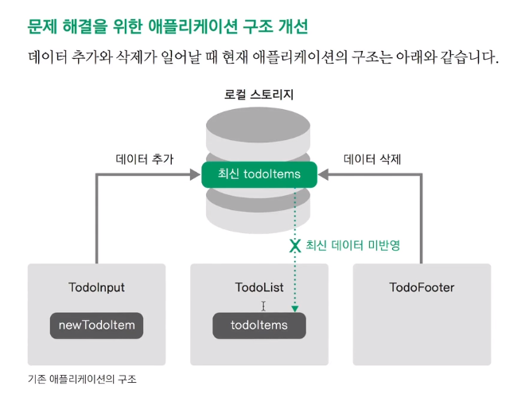
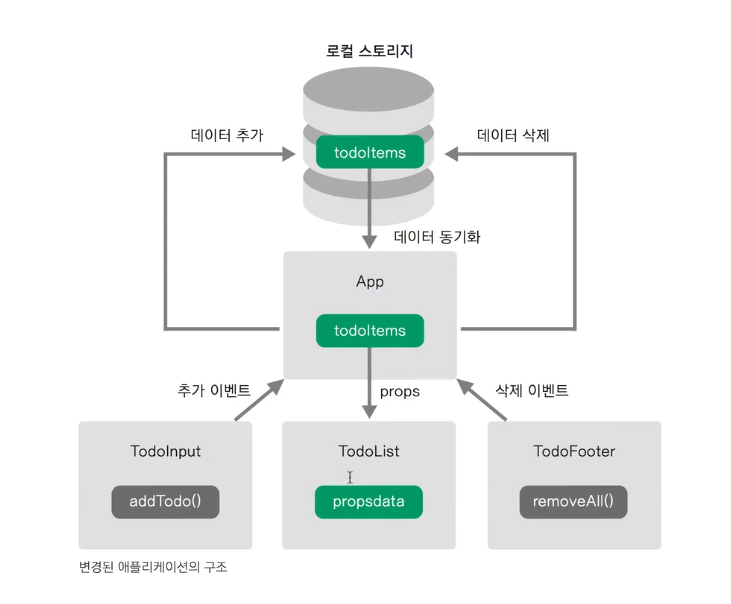

# vue 중급 시작하기!

## 0 . 시작하기 전에

- visual studio code 설치하기!
  - vetur
  - tslint : 문법 오류, API 오류 해결을 위해
- Node.js, Chrome, Vue.js 크롬 플러그인, Github.com 설치하기!

## 1. Vue-cli로 프로젝트 실행하기

- 아무것도 없는 빈 폴더부터 시작한다면?

  - `bash`

    ```bash
    node -v 
    npm -v
    npm install -g @vue/cli
    ```

  - 에러가 났다면?  permission error 일 가능성이 크다. 권한이 없기 때문에 나는 에러이다.
    - 앞에 `sudo`를 붙여주자.

    `vue-cli 2.x version`

    ```bash
    vue init webpack-simple vue-todo

    cd vue-todo
    npm install
    npm run dev
    ```
    `vue-cli 3.x version`

    ```bash
    vue create 프로젝트 폴더 위치
    ```

  - 프로젝트 생성

    `bash` `3.x` 

      ```bash```
    vue create vue-todo
      ```
    // 만들고 나서
    // rm -rf vue-todo
    // vue init webpack-simple vue-todo

    // cd vue-todo
    // npm install
    // npm run dev
      ```

  ```
    cd vue-todo
    npm run serve
  ```

## [중요] VS code에서 git bash 사용하기

- VS code 실행 후 `ctrl`+`,`입력 후 설정에 들어갑니다.
- 검색창에 `  terminal.integrated.shell.windows` 입력합니다.
- `json` 형식 나올텐데 밑에꺼 복붙하면 됩니다.

    ```
    "terminal.integrated.shell.windows": "C:\\Program Files\\Git\\bin\\bash.exe"
    ```


## 2. 만들 앱 설계

- todo 앱 만들 예정
  - 헤더 - TodoHeader.vue
  - 인풋 - TodoInput.vue
  - 리스트 - TodoList.vue
  - 푸터 - TodoFooter.vue

## 3. 컴포넌트 생성 및 등록하기

- `components` 폴더 -->   `TodoHeader` 파일 생성

  

- `App.vue` 스켈레톤 코드 작성하기

- 대박 단축키 하나 찾음 `ctrl`+`D` 하고 마우스로 같은단어 클릭하면 두개 동시에 바꿀 수 있도록 지원해준다.. 대박쓰!

- ```vue
  <template>
    <div id="app">
      <!-- 표시하기 위해 컴포넌트에 등록된 요소를 배치해주자 -->
      <todo-header></todo-header>
      <todo-input></todo-input>
      <todo-list></todo-list>
      <todo-footer></todo-footer>
    </div>
  </template>

  <script>
  // 1. 먼저 이렇게 임포트 해준다.
  import TodoHeader from './components/TodoHeader.vue';
  import TodoInput from './components/TodoInput.vue';
  import TodoList from './components/TodoList.vue';
  import TodoFooter from './components/TodoFooter.vue';
  ```


  export default {
    // 2. 쓰려면 컴포넌트로 등록해주자.
    components:{
      'todo-header':TodoHeader,
      'todo-input':TodoInput,
      'todo-list':TodoList,
      'todo-footer':TodoFooter
    }
  }
  </script>

  <style>

  </style>
  ```

## 4. 파비콘, 아이콘, 폰트, 반응형 태그 설정하기

- 파비콘 제작 : <https://www.favicon-generator.org/>

- 폰트 어썸(아이콘 제작) : <https://fontawesome.com/>
   - 유저별 키트 하나씩 발급하는데 이 키트하나로 이용가능하다.
- `   <script src="https://use.fontawesome.com/releases/v5.2.0/js/all.js"></script>`
     - 이건 예전버전 fontawesome인데 따로 kits 발급 안받아도 사용 가능하다고 함..

- 구글 폰트 : [http://noonnu.cc](http://noonnu.cc/)

`index.html`

​```html
<!DOCTYPE html>
<html lang="en">
  <head>
    <meta charset="utf-8">
    <title>vue-intermediate</title>
    <!-- 1. 뷰포트 추가 -->
    <meta name="viewport" content="initial-scale=1, width=divice-width">
    <!-- 2. favicon 추가 -->
    <link rel="shortcut icon" href="src/assets/favicon.ico" type="image/x-icon">
    <link rel="icon" href="src/assets/favicon.ico" type="image/x-icon">
    <!-- 3. awesomefont 추가 -->
    <script src="https://kit.fontawesome.com/15453d02ad.js"></script>
    <!-- 4. google font 추가 -->
    <link href="https://fonts.googleapis.com/css?family=Ubuntu&display=swap" rel="stylesheet">

  </head>
  <body>
    <div id="app"></div>
    <script src="/dist/build.js"></script>
  </body>
</html>

  ```

## 5. TodoHeader 컴포넌트 구현

- 컴포넌트 안에서만 유요한 css를 적용시키고 싶을 때 scope 태그를 이용한다.

`TodoHeader`

```html
<template>
    <div>
        <h1>Todo it!</h1>
    </div>
</template>

<style scoped>
/* 컴포넌트 안에서만 유효한 속성을 만들고 싶을 떄 scope를 사용한다. */
h1{
    color:#2f3b52;
    font-weight:900;
    margin:2.5rem 0 1.5rem;
}

</style>
```

`App.vue`

```html
<template>
 ...
</template>

<script>
...
</script>

<style>
body{
  text-align: center;
  background-color:#f6f6f6;
}
input{
  border-style: groove;
  width:200px;
}
button{
  border-style:groove;
}
.shadow{
  box-shadow: 5px 10px 10px rgba(0,0,0,0.03);
}
</style>

```

## 6. TodoInput 컴포넌트의 할 일 저장 구현

- localStorage mdn

`TodoInput.vue`

```vue
<template>
    <div>
        <!-- 엔터를 쳤을 때도 특정 로직이 실행되도록 돕는 v-on:keyup.enter 함수 -->
        <input type="text" v-model="newTodoItem" v-on:keyup.enter="addTodo">
        <button v-on:click="addTodo">add</button>
    </div>
</template>

<script>
import { log } from 'util';
export default {
    data:function(){
        return {
            newTodoItem:''
        }
    },
    methods:{
        addTodo:function(){
            console.log(this.newTodoItem);
            //저장하는 로직. API --- > key, value 
            localStorage.setItem(this.newTodoItem, this.newTodoItem);
            this.newTodoItem='';
        }
    }
}
</script>

<style>

</style>
```

## 7 . TodoInput 정리 및 UI 스타일링 하기

- 메서드의 분리가 필요하다.

```vue
<template>
    <div class='inputBox shadow'>
        <!-- 엔터를 쳤을 때도 특정 로직이 실행되도록 돕는 v-on:keyup.enter 함수 -->
        <input type="text" v-model="newTodoItem" v-on:keyup.enter="addTodo">
        <!-- <button v-on:click="addTodo">add</button> -->
        <span class="addContainer" v-on:click="addTodo">
            <i class="fas fa-plus addBtn"></i>
        </span>
    </div>
</template>
<script>
import { log } from 'util';
export default {
...
    methods:{
        addTodo:function(){
            console.log(this.newTodoItem);
            //저장하는 로직. API --- > key, value 
            localStorage.setItem(this.newTodoItem, this.newTodoItem);
            // this.newTodoItem='';
            this.clearInput();
        },
        // method 분할하기
        clearInput:function(){
            this.newTodoItem='';
        }
    }
}
</script>
<style scoped>
    input:focus{
        outline: none;
    }
    .inputBox{
        background:white;
        height: 50px;
        line-height: 50px;
        border-radius: 5px;
    }
    .inputBox input{
        border-style: none;
        font-size: 0.9rem;
    }
    .addContainer{
        float:right;
        background:linear-gradient(to right,#6478fb,#8763fb);
        display: block;
        width:3rem;
        border-radius: 0 5px 5px 0;
    }
    .addBtn{
        color:white;
        vertical-align: middle;
    }
</style>
```

- 처음 프로젝트를 하면 fontawesome 에서 kit을 받아서 `head`에 넣어야한다. ~~키트 안넣으면 아이콘 안뜬다~~
## 8. TodoList 컴포넌트의 할 일 목록 표시기능 구현

- `ul>li*3`

  - ```html
    <ul>
        <li></li>
        <li></li>
        <li></li>
    </ul>
    ```

```html
<template>
    <div>
        <ul>
            <li v-for="todoItem in todoItems" v-bind:key="todoItem">
                {{todoItem}}
            </li>
            <!-- 
			<li>1</li>
            <li>2</li>
            <li>3</li> 
			-->
        </ul>
    </div>
</template>

<script>
export default {
    data:function(){
        return {
            todoItems:[]
        }
    },
    created:function(){
        if(localStorage.length>0){
            for(var i =0;i<localStorage.length;i++){
                if(localStorage.key(i) !== "loglevel:webpack-dev-server"){
                    this.todoItems.push(localStorage.key(i));
                }
            }
        }
    }
}
</script>

<style>

</style>
```

## 9. TodoList 컴포넌트 UI 스타일링

```vue
<template>
    <div>
        <ul>
            <li v-for="todoItem in todoItems" v-bind:key="todoItem" class='shadow'>
                    {{todoItem}}
                    <span class='removeBtn'>
                        <i class="fas fa-trash-alt"></i>
                    </span>
            </li>
            <!-- <li>1</li>
            <li>2</li>
            <li>3</li> -->
        </ul>
    </div>
</template>
```

```css
<style scoped>
ul{
    list-style-type: none;
    padding-left:0px;
    margin-top:0px;
    text-align:left;
}
li{
    display: flex;
    min-height: 50px;
    height: 50px;
    line-height: 50px;
    margin:0.5rem 0;
    padding:0 0.9rem;
    background:white;
    border-radius: 5px;
}
.removeBtn{
    margin-left: auto;
    color:#de4343;
}
.checkBtn{
    line-height: 45px;
    color:#45acde;
    margin-right: 5px;
}
.checkBtnCompleted{
    color:#b3adad;
}
.textCompleted{
    text-decoration: line-through;
    color: #b3adad;
}
</style>
```

## 10. TodoList 컴포넌트 할 일 삭제 기능 구현

- 제거가 실제 구현되기 위한 제거 methods 구현해보기

```html
<template>
    <div>
        <ul>
            <li v-for="(todoItem,index) in todoItems" v-bind:key="todoItem.item" class='shadow'>
                {{todoItem}}
                <span class='removeBtn' v-on:click="removeTodo(todoItem,index)">
                    <i class="fas fa-trash-alt"></i>
                </span>
            </li>
            <!-- <li>1</li>
            <li>2</li>
            <li>3</li> -->
        </ul>
    </div>
</template>

<script>
export default {
    data:function(){
        return {
            todoItems:[]
        }
    },
    created:function(){
        if(localStorage.length>0){
            for(var i =0;i<localStorage.length;i++){
                if(localStorage.key(i) !== "loglevel:webpack-dev-server"){
                    this.todoItems.push(localStorage.key(i));
                }
            }
        }
    },
    methods:{
        removeTodo:function(todoItem,index){
            // console.log(todoItem,index);
            localStorage.removeItem(todoItem);
            // 특정 인덱스에서 하나 지울 수 있다. splice
            this.todoItems.splice(index,1);
        }
    }
}
</script>

<style scoped>
...
</style>

```

## 11. TodoList 컴포넌트의 할 일 완료 구현

`TodoInput.vue` 수정

```js
<script>
export default {
    data:function(){
        return {
            newTodoItem:''
        }
    },
    methods:{
        addTodo:function(){
            if(this.newTodoItem!=''){
            // 이부분 수정 JSON stringify 사용한다.
            var obj = {
                completed:false,
                item:this.newTodoItem
            }
            localStorage.setItem(this.newTodoItem, JSON.stringify(obj)); 
            this.clearInput();
            }
        },
        clearInput:function(){
            this.newTodoItem='';
        }
    }
}
</script>
```

`json` 문법 이용

```json
json.stringify <--> json.parse
```

`TodoList.vue` 수정

```html
<template>
    <div>
        <ul>
            <li v-for="(todoItem,index) in todoItems" v-bind:key="todoItem.item" class='shadow'>
                <i class="checkBtn fas fa-check" v-on:click='toggleComplete'></i>
                {{todoItem.item}}	<<< !---- />
                <span class='removeBtn' v-on:click="removeTodo(todoItem,index)">
                    <i class="fas fa-trash-alt"></i>
                </span>
            </li>
        </ul>
    </div>
</template>

<script>
export default {
    data:function(){
        return {
            todoItems:[]
        }
    },
    created:function(){
        if(localStorage.length>0){
            for(var i =0;i<localStorage.length;i++){
                if(localStorage.key(i) !== "loglevel:webpack-dev-server"){
                   ///이부분 수정
                  this.todoItems.push(JSON.parse(localStorage.getItem(localStorage.key(i))));
                }
            }
        }
    },
    methods:{
        removeTodo:function(todoItem,index){
            console.log(todoItem,index);
            localStorage.removeItem(todoItem);
            // 특정 인덱스에서 하나 지울 수 있다. splice
            this.todoItems.splice(index,1);
        },
        toggleComplete:function(){
        }
    }
}
</script>

<style>
...
</style>

```

- `v-bind:class` 를 이용해서 toggle 을 적용해보자.

```html
<template>
    <div>
        <ul>
            <li v-for="(todoItem,index) in todoItems" v-bind:key="todoItem.item" class='shadow'>
                <i class="checkBtn fas fa-check" v-bind:class="{checkBtnCompleted : todoItem.completed}" 
                    v-on:click='toggleComplete(todoItem,index)'></i>
                <span v-bind:class='{textCompleted : todoItem.completed}'>{{todoItem.item}}</span>
                <span class='removeBtn' 
                    v-on:click="removeTodo(todoItem,index)"
                    v-bind:class="{checkBtnCompleted : todoItem.completed}">
                    <i class="fas fa-trash-alt"></i>
                </span>
            </li>
        </ul>
    </div>
</template>

<script>
export default {
    data:function(){
        return {
            todoItems:[]
        }
    },
    created:function(){
        if(localStorage.length>0){
            for(var i =0;i<localStorage.length;i++){
                if(localStorage.key(i) !== "loglevel:webpack-dev-server"){
                    this.todoItems.push(JSON.parse(localStorage.getItem(localStorage.key(i))));
                }
            }
        }
    },
    methods:{
        removeTodo:function(todoItem,index){
            console.log(todoItem,index);
            localStorage.removeItem(todoItem);
            // 특정 인덱스에서 하나 지울 수 있다. splice
            this.todoItems.splice(index,1);
        },
        toggleComplete:function(todoItem,index){
            console.log(todoItem,index);
            todoItem.completed = !todoItem.completed;

            //localStorage 데이터 갱신
            localStorage.removeItem(todoItem.item,index);
            localStorage.setItem(todoItem.item,JSON.stringify(todoItem));
        }
    }
}
</script>

<style>
...
</style>

```

## 12. TodoFooter 컴포넌트 구현

- 리스트 전체를 지우는 삭제 버튼 구현하기

```html
<template>
    <div class="clearAllContainer">
        <span class="clearAllBtn" v-on:click="clearTodo">clear all</span>
    </div>
</template>

<script>
export default {
    methods:{
        // 이거 하면 뷰에는 바로 반영 안된다.. 이걸 리팩토링 해보자
        clearTodo:function(){
            localStorage.clear();
        }
    }
}
</script>

<style scoped>
.clearAllContainer{
    width:8.5rem;
    height: 50px;
    line-height: 50px;
    background-color: white;
    border-radius: 5px;
    margin:0 auto;
}
.clearAllBtn{
    color:#e20303;
    display:block;
}
</style>

```

## 13 . 깃헙 브랜치 안내

https://github.com/joshua1988/vue-intermediate

## 14. 문제점 개선한 구조 안내

- 추가를 했더니 뷰에 잘 갱신이 안되는 경우
  - input 에서 추가를 했지만 리스트에는 추가를 하지 않았다.
  - 컴포넌트간의 통신 구조를 개선한다.





- 컨테이너의 개념으로 생각하면 된다.
- 비즈니스 로직 데이터 조작에 관련된 것을 컨테이너라고 한다.
- 뷰엑스 컴포넌트에 사용할 데이터를 한곳에다 몰아넣음. 작은 버젼의 뷰엑스 구조라고 생각하면 된다.

## 15. [리팩토링] 할 일 목록 표시 기능

- `App.vue`

```vue
<template>
  <div id="app">
    <TodoHeader></TodoHeader>
    <TodoInput></TodoInput>
    <!-- v-bind:[내릴 데이터]="현재 컴포넌트에서 가지고 있는 데이터" -->
    <TodoList v-bind:propsdata="todoItems"></TodoList>
    <TodoFooter></TodoFooter>
  </div>
</template>

<script>
import TodoHeader from './components/TodoHeader.vue'
import TodoInput from './components/TodoInput.vue'
import TodoList from './components/TodoList.vue'
import TodoFooter from './components/TodoFooter.vue'

export default {
  // 로컬 스토리지에 있던 데이터를 가져온다.
    data:function(){
    return {
      todoItems:[]
    }
  },
  components: {
    TodoHeader: TodoHeader,
    TodoInput: TodoInput,
    TodoList: TodoList,
    TodoFooter: TodoFooter
  },
    created: function() {
    if (localStorage.length > 0) {
      for (var i = 0; i < localStorage.length; i++) {
        if (localStorage.key(i) !== 'loglevel:webpack-dev-server') {
          this.todoItems.push(JSON.parse(localStorage.getItem(localStorage.key(i))));
        }
      }
    }
  }
}
</script>

<style>
body {
...
</style>

```

- `Todolist.vue`

```vue
<template>
  <section>
    <ul>
      <!-- 2. 여기 바꿔주기 -->
      <!-- <li v-for="(todoItem, index) in todoItems" class="shadow" v-bind:key="todoItem.item"> -->
        <li v-for="(todoItem, index) in propsdata" class="shadow" v-bind:key="todoItem.item">
        <i class="checkBtn fas fa-check" v-bind:class="{checkBtnCompleted: todoItem.completed}" v-on:click="toggleComplete(todoItem, index)"></i>
        <span v-bind:class="{textCompleted: todoItem.completed}">{{ todoItem.item }}</span>
        <span class="removeBtn" v-on:click="removeTodo(todoItem, index)">
          <i class="removeBtn fas fa-trash-alt"></i>
        </span>
      </li>
    </ul>
  </section>
</template>

<script>
export default {
  // 1. 이쪽 추가하기.
  props:['propsdata'],
  data: function() {
    return {
      todoItems: []
    }
  },
  methods: {
    removeTodo: function(todoItem, index) {
      this.todoItems.splice(index, 1);
      localStorage.removeItem(todoItem);
    },
    toggleComplete: function(todoItem, index) {
      todoItem.completed = !todoItem.completed;
      localStorage.removeItem(todoItem.item);
      localStorage.setItem(todoItem.item, JSON.stringify(todoItem));
    }
  }
}
</script>

<style scoped>
...
</style>

```

## *** 잠깐 짱나는 일 생겨서 기록남깁니다.

- 프로젝트를 데스크탑에서 진행하다가 맥으로 옮겨서 진행하려고 함.
- 이전까지 강의 들었던거 다시 치는것보다 저장시점 옮겨서 중간부터 들으려고 깃허브 클론을 받아옴.
- 에러 자꾸 나면서 안돌아감..
- 원인
  1. sudo 안해줘서.
  2. vue-todo 들어가기 전에 `npm install -g @vue/cli` 해줘야 하고, `cd vue-todo` 로 입장해서 `npm install` 해줘야합니다. 그리고 캡틴판교님은 `2.x`버전을 이용하셨기 때문에 `npm run dev` 를 이용하여 서버를 구동시켜야합니다.
- 끝

## 15. [리팩토링] 할 일 추가 기능

- 할 일 인풋에 날리면 바로 UI에 추가되는 기능을 추가해보자.
- `this.$emit('데이터이름')`으로 데이터를 올려보내고, `v-on:데이터이름="현재컴포넌트 메서드"`로 중개자가 받은 후 메서드에서 처리하는 과정을 담았다.

`App.vue`

```Vue
<template>
  <div id="app">
    <TodoHeader></TodoHeader>
    <!-- v-on:[하위 컴포넌트에서 발생시킨 이벤트 이름]="[현재 컴포넌트 메서드 명]" -->
    <TodoInput v-on:addTodoItem="addOneItem"></TodoInput>
    <!-- v-bind:[내려보낼 속성 이름]="현재 컴포넌트 속성 이름" -->
    <TodoList v-bind:propsdata="todoItems"></TodoList>
    <TodoFooter></TodoFooter>
  </div>
</template>

<script>
import TodoHeader from './components/TodoHeader.vue'
import TodoInput from './components/TodoInput.vue'
import TodoList from './components/TodoList.vue'
import TodoFooter from './components/TodoFooter.vue'

export default {
  data:function(){
    return {
      todoItems:[]
    }
  },
  components: {
    TodoHeader: TodoHeader,
    TodoInput: TodoInput,
    TodoList: TodoList,
    TodoFooter: TodoFooter
  },
  methods:{
    addOneItem:function(todoItem){
      // 가져온 변수로 매핑시켜주면 된다.
        var obj = {completed: false, item: todoItem};
        localStorage.setItem(todoItem, JSON.stringify(obj));
        //아이템을 넣어준다.
        this.todoItems.push(obj);
    }
  },
  created: function() {
    if (localStorage.length > 0) {
      for (var i = 0; i < localStorage.length; i++) {
        if (localStorage.key(i) !== 'loglevel:webpack-dev-server') {
          this.todoItems.push(JSON.parse(localStorage.getItem(localStorage.key(i))));
        }
      }
    }
  }  
}
</script>

<style>
...
</style>

```

`TodoInput.vue`

```Vue
<template>
  <div class="inputBox shadow">
    <input type="text" v-model="newTodoItem" v-on:keyup.enter="addTodo">
    <span class="addContainer" v-on:click="addTodo">
      <i class="addBtn fas fa-plus" aria-hidden="true"></i>
    </span>
  </div>
</template>

<script>
export default {
  data: function() {
    return {
      newTodoItem: ''
    }
  },
  methods: {
    addTodo: function() {
      if (this.newTodoItem !== '') {

        // this.$emit('이벤트 이름',인자 1,인자 2,...);
        // 이벤트가 하위에서 발생
        this.$emit('addTodoItem',this.newTodoItem);

        //App.vue로 이동시킬 코드
        // var obj = {completed: false, item: this.newTodoItem};
        // localStorage.setItem(this.newTodoItem, JSON.stringify(obj));

        this.clearInput();
      }
    },
    clearInput: function() {
      this.newTodoItem = '';
    }
  }
}
</script>

<style scoped>
...
</style>

```

## 16. [리팩토링] 할 일 삭제 기능

- 마찬가지로 이벤트 발생시켜서 `App.vue`에서 처리하도록 함
- `TodoList.vue`

```Vue
<script>
export default {
  props:['propsdata'],
  methods: {
    removeTodo: function(todoItem, index) {
      // 뿌려주는 역할만 수행하고 나머지는 App.vue에서 처리하도록 한다. 고로 데이터 그대로 위 컴포넌트로 전달!
      this.$emit('removeItem',todoItem,index);
    },
    toggleComplete: function(todoItem, index) {
      todoItem.completed = !todoItem.completed;
      localStorage.removeItem(todoItem.item);
      localStorage.setItem(todoItem.item, JSON.stringify(todoItem));
    }
  }
}
</script>
```

- `App.vue`

```Vue
<template>
  <div id="app">
    <TodoHeader></TodoHeader>
    <!-- v-on:[하위 컴포넌트에서 발생시킨 이벤트 이름]="[현재 컴포넌트 메서드 명]" -->
    <TodoInput v-on:addTodoItem="addOneItem"></TodoInput>
    <!-- v-bind:[내려보낼 속성 이름]="현재 컴포넌트 속성 이름" -->
    <TodoList v-bind:propsdata="todoItems" v-on:removeItem="removeOneItem"></TodoList>
    <TodoFooter></TodoFooter>
  </div>
</template>

<script>
import TodoHeader from './components/TodoHeader.vue'
import TodoInput from './components/TodoInput.vue'
import TodoList from './components/TodoList.vue'
import TodoFooter from './components/TodoFooter.vue'

export default {
  data:function(){
    return {
      todoItems:[]
    }
  },
  components: {
    TodoHeader: TodoHeader,
    TodoInput: TodoInput,
    TodoList: TodoList,
    TodoFooter: TodoFooter
  },
  methods:{
    addOneItem:function(todoItem){
      // 가져온 변수로 매핑시켜주면 된다.
        var obj = {completed: false, item: todoItem};
        localStorage.setItem(todoItem, JSON.stringify(obj));
        //아이템을 넣어준다.
        this.todoItems.push(obj);
    },
    removeOneItem:function(todoItem,index){
      // JSON 형식으로 가져오는 todoItem이기 때문에 한단계 더 들어가줘야 한다.
      localStorage.removeItem(todoItem.item);
      this.todoItems.splice(index,1);
    }
  },
  created: function() {
    if (localStorage.length > 0) {
      for (var i = 0; i < localStorage.length; i++) {
        if (localStorage.key(i) !== 'loglevel:webpack-dev-server') {
          this.todoItems.push(JSON.parse(localStorage.getItem(localStorage.key(i))));
        }
      }
    }
  }  
}
</script>
```

## 17. [리팩토링] 할 일 완료 기능

- 마찬가지로 이벤트 발생시켜서 `App.vue`에서 처리하도록 함
- `TodoList.vue`

```Vue
<template>
  <section>
    <ul>
      <li v-for="(todoItem, index) in propsdata" class="shadow" v-bind:key="todoItem.item">
        <i class="checkBtn fas fa-check" v-bind:class="{checkBtnCompleted: todoItem.completed}" v-on:click="toggleComplete(todoItem, index)"></i>
        <span v-bind:class="{textCompleted: todoItem.completed}">{{ todoItem.item }}</span>
        <i class="removeBtn fas fa-trash-alt" v-bind:class="{checkBtnCompleted: todoItem.completed}" v-on:click="removeTodo(todoItem, index)"></i>
      </li>
    </ul>
  </section>
</template>

<script>
export default {
  props:['propsdata'],
  methods: {
    removeTodo: function(todoItem, index) {
      // 뿌려주는 역할만 수행하고 나머지는 App.vue에서 처리하도록 한다. 고로 데이터 그대로 위 컴포넌트로 전달!
      this.$emit('removeItem',todoItem,index);
    },
    toggleComplete: function(todoItem, index) {
      this.$emit('toggleItem',todoItem,index);
      // todoItem.completed = !todoItem.completed;
      // localStorage.removeItem(todoItem.item);
      // localStorage.setItem(todoItem.item, JSON.stringify(todoItem));
    }
  }
}
</script>
```

- `App.vue`

```Vue
<template>
  <div id="app">
    <TodoHeader></TodoHeader>
    <!-- v-on:[하위 컴포넌트에서 발생시킨 이벤트 이름]="[현재 컴포넌트 메서드 명]" -->
    <TodoInput v-on:addTodoItem="addOneItem"></TodoInput>
    <!-- v-bind:[내려보낼 속성 이름]="현재 컴포넌트 속성 이름" -->
    <TodoList v-bind:propsdata="todoItems" v-on:removeItem="removeOneItem" v-on:toggleItem="toggleOneItem"></TodoList>
    <TodoFooter></TodoFooter>
  </div>
</template>

<script>
import TodoHeader from './components/TodoHeader.vue'
import TodoInput from './components/TodoInput.vue'
import TodoList from './components/TodoList.vue'
import TodoFooter from './components/TodoFooter.vue'

export default {
  data:function(){
    return {
      todoItems:[]
    }
  },
  components: {
    TodoHeader: TodoHeader,
    TodoInput: TodoInput,
    TodoList: TodoList,
    TodoFooter: TodoFooter
  },
  methods:{
    addOneItem:function(todoItem){
      // 가져온 변수로 매핑시켜주면 된다.
        var obj = {completed: false, item: todoItem};
        localStorage.setItem(todoItem, JSON.stringify(obj));
        //아이템을 넣어준다.
        this.todoItems.push(obj);
    },
    removeOneItem:function(todoItem,index){
      localStorage.removeItem(todoItem.item);
      this.todoItems.splice(index,1);
    },
    toggleOneItem:function(todoItem,index){
      // todoItem.completed = !todoItem.completed;
      this.todoItems[index].completed = !this.todoItems[index].completed;
      localStorage.removeItem(todoItem.item);
      localStorage.setItem(todoItem.item, JSON.stringify(todoItem));
    }
  },
  created: function() {
    if (localStorage.length > 0) {
      for (var i = 0; i < localStorage.length; i++) {
        if (localStorage.key(i) !== 'loglevel:webpack-dev-server') {
          this.todoItems.push(JSON.parse(localStorage.getItem(localStorage.key(i))));
        }
      }
    }
  }  
}
</script>
```

## 18. [리팩토링] 할 일 모두 삭제 푸터 기능 추가

- `TodoFooter.vue`

```Vue
<template>
  <div class="clearAllContainer">
    <span class="clearAllBtn" v-on:click="clearTodo">Clear All</span>
  </div>
</template>

<script>
export default {
  methods: {
    clearTodo: function() {
      // localStorage.clear();
      this.$emit('clearEvent');
    }
  }
}
</script>
```

- `App.vue`

```Vue
<template>
  <div id="app">
    <TodoHeader></TodoHeader>
    <!-- v-on:[하위 컴포넌트에서 발생시킨 이벤트 이름]="[현재 컴포넌트 메서드 명]" -->
    <TodoInput v-on:addTodoItem="addOneItem"></TodoInput>
    <!-- v-bind:[내려보낼 속성 이름]="현재 컴포넌트 속성 이름" -->
    <TodoList v-bind:propsdata="todoItems" v-on:removeItem="removeOneItem" v-on:toggleItem="toggleOneItem"></TodoList>
    <TodoFooter v-on:clearEvent="clearAllItem"></TodoFooter>
  </div>
</template>

<script>
import TodoHeader from './components/TodoHeader.vue'
import TodoInput from './components/TodoInput.vue'
import TodoList from './components/TodoList.vue'
import TodoFooter from './components/TodoFooter.vue'

export default {
  data:function(){
    return {
      todoItems:[]
    }
  },
  components: {
    TodoHeader: TodoHeader,
    TodoInput: TodoInput,
    TodoList: TodoList,
    TodoFooter: TodoFooter
  },
  methods:{
    addOneItem:function(todoItem){
      // 가져온 변수로 매핑시켜주면 된다.
        var obj = {completed: false, item: todoItem};
        localStorage.setItem(todoItem, JSON.stringify(obj));
        //아이템을 넣어준다.
        this.todoItems.push(obj);
    },
    removeOneItem:function(todoItem,index){
      localStorage.removeItem(todoItem.item);
      this.todoItems.splice(index,1);
    },
    toggleOneItem:function(todoItem,index){
      // todoItem.completed = !todoItem.completed;
      this.todoItems[index].completed = !this.todoItems[index].completed;
      localStorage.removeItem(todoItem.item);
      localStorage.setItem(todoItem.item, JSON.stringify(todoItem));
    },
    clearAllItem:function(){
      localStorage.clear();
      this.todoItems = [];
    }
  },
  created: function() {
    if (localStorage.length > 0) {
      for (var i = 0; i < localStorage.length; i++) {
        if (localStorage.key(i) !== 'loglevel:webpack-dev-server') {
          this.todoItems.push(JSON.parse(localStorage.getItem(localStorage.key(i))));
        }
      }
    }
  }  
}
</script>
```

## 19 . 리팩토링이 완료된 어플리케이션 정리

1. 구조 변환
   - 데이터 구조를 변동시키므로서 컨테이너라는 개념 탄생시킴
   - 각 고유 컴포넌트가 각 데이터를 가지고 있었으나 한개의 컴포넌트로 몰아서 데이터 조작을 다 시킴
   - 조작된 데이터를 각 컴포넌트에 뿌려주는 구조를 가짐. - 컨테이너 컴포넌트 구조
   - 끝단 컴포넌트는 UI 표기만 할 것을 권장.
   - 중앙 관리식 데이터 컴포넌트 관리 - 뷰엑스의 축소판이라고 한다.
   - 한곳에서 데이터를 관리하는 시스템
2. transition , library 를 이용하여 애니매이션으로 해결한다.
3. 모달 컴포넌트로 진행할 예정!

## 20 . 모달 컴포넌트 등록

- Components
  - common
    - modal.vue 
- 의 폴더 구조 생성한다.
- https://vuejs.org/v2/examples/modal.html 여기를 이용할 것이다.
- `TodoInput.vue`의 하위 컴포넌트로 등록 해준다.

```vue
<template>
  <div class="inputBox shadow">
    <input type="text" v-model="newTodoItem">
    <span class="addContainer" v-on:click="addTodo">
      <i class="addBtn fas fa-plus" aria-hidden="true"></i>
    </span>
      <!-- use the modal component, pass in the prop -->
    <modal-components v-if="showModal" @close="showModal = false">
      <!--
        you can use custom content here to overwrite
        default content
      -->
      <h3 slot="header">custom header</h3>
    </modal-components>
  </div>
</template>

<script>
// 하위 컴포넌트로 등록해주었다.
import Modal from './common/Modal.vue';

export default {
  data: function() {
    return {
      newTodoItem: '',
      showModal:false
    }
  },
  methods: {
    addTodo: function() {
      if (this.newTodoItem !== '') {
        this.$emit('addItem', this.newTodoItem);
        this.clearInput();
      }
    },
    clearInput: function() {
      this.newTodoItem = '';
    }
  },
  // 컴포넌트 추가
  components:{
    'modal-components':Modal
  }
}
</script>

<style scoped>
...
</style>

```

## 21. 모달 컴포넌트의 slot 소개 및 퀴즈

- 슬롯 : 다시 정의할 수 있음. 너가 원하는 컨텐트를 통해 모달을 재정의 할 수 있음.
- 모달 내부의 내용을 내맘대로 다시 정의할 수 있다.

## 22. 풀이 및 코드 구현

- 클로즈 버튼 추가 구현
- fontawesome - times 검색
- v-on = @

`Modal.vue`

```vue
<template>
   <transition name="modal">
    <div class="modal-mask">
      <div class="modal-wrapper">
        <div class="modal-container">

          <div class="modal-header">
            <slot name="header">
              default header
            </slot>
          </div>

          <div class="modal-body">
            <slot name="body">
              default body
            </slot>
          </div>
        </div>
      </div>
    </div>
  </transition>   
</template>

<script>

export default {

}
</script>

<style>
.modal-mask {
  position: fixed;
  z-index: 9998;
  top: 0;
  left: 0;
  width: 100%;
  height: 100%;
  background-color: rgba(0, 0, 0, .5);
  display: table;
  transition: opacity .3s ease;
}

.modal-wrapper {
  display: table-cell;
  vertical-align: middle;
}

.modal-container {
  width: 300px;
  margin: 0px auto;
  padding: 20px 30px;
  background-color: #fff;
  border-radius: 2px;
  box-shadow: 0 2px 8px rgba(0, 0, 0, .33);
  transition: all .3s ease;
  font-family: Helvetica, Arial, sans-serif;
}

.modal-header h3 {
  margin-top: 0;
  color: #42b983;
}

.modal-body {
  margin: 20px 0;
}

.modal-default-button {
  float: right;
}

/*
 * The following styles are auto-applied to elements with
 * transition="modal" when their visibility is toggled
 * by Vue.js.
 *
 * You can easily play with the modal transition by editing
 * these styles.
 */

.modal-enter {
  opacity: 0;
}

.modal-leave-active {
  opacity: 0;
}

.modal-enter .modal-container,
.modal-leave-active .modal-container {
  -webkit-transform: scale(1.1);
  transform: scale(1.1);
}
</style>

```

`TodoInput.vue`

```vue
<template>
  <div class="inputBox shadow">
    <input type="text" v-model="newTodoItem">
    <span class="addContainer" v-on:click="addTodo">
      <i class="addBtn fas fa-plus" aria-hidden="true"></i>
    </span>
      <!-- use the modal component, pass in the prop -->
    <modal-components v-if="showModal" @close="showModal = false">
      <!--
        you can use custom content here to overwrite
        default content
      -->
      <h3 slot="header">경고!
        <i class="closeModalBtn fas fa-times" @click="showModal=false"></i>
      </h3>
      <p slot="body">아무것도 입력하지 않으셨습니다.</p>
    </modal-components>
  </div>
</template>

<script>
// 하위 컴포넌트로 등록해주었다.
import Modal from './common/Modal.vue';

export default {
  data: function() {
    return {
      newTodoItem: '',
      showModal:false
    }
  },
  methods: {
    addTodo: function() {
      if (this.newTodoItem !== '') {
        this.$emit('addItem', this.newTodoItem);
        this.clearInput();
      }else{
        this.showModal = !this.showModal;
      }
    },
    clearInput: function() {
      this.newTodoItem = '';
    }
  },
  // 컴포넌트 추가
  components:{
    'modal-components':Modal
  }
}
</script>

<style scoped>
input:focus {
  outline: none;
}
.inputBox {
  background: white;
  height: 50px;
  line-height: 50px;
  border-radius: 5px;
}
.inputBox input {
  border-style: none;
  font-size: 0.9rem;
}
.addContainer {
  float: right;
  background: linear-gradient(to right, #6478FB, #8763FB);
  display: block;
  width: 3rem;
  border-radius: 0 5px 5px 0;
}
.addBtn {
  color: white;
  vertical-align: middle;
}
.closeModalBtn{

}
</style>
```

## 23. 트랜지션 소개 및 구현

- 사용자 관점의 css 구현
- 트랜지션으로 UI 개선이 가능하다.
- https://vuejs.org/v2/guide/transitions.html#List-Transitions 여기에서 가능

## 24. 강의 정리

- ~~뷰 cli 를 이용한 프로젝트 구성 방법~~
- ~~컴포넌트 기반 설계 방법~~
- ~~컴포넌트 구조화 및 컴포넌트간 통신 방법~~ 
- ES6을 통한 효율적이고 간결한 코딩 방법
- Vuex를 이용한 상태관리의 이해 방법

## 다음 페이지에서 구현 고고씽


