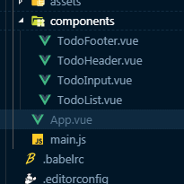

# vue 중급 시작하기!

## 0 . 시작하기 전에

- visual studio code 설치하기!
  - vetur
  - tslint : 문법 오류, API 오류 해결을 위해
- Node.js, Chrome, Vue.js 크롬 플러그인, Github.com 설치하기!

## 1. Vue-cli로 프로젝트 실행하기

- 아무것도 없는 빈 폴더부터 시작한다면?

  - `bash`

    ```bash
    node -v 
    npm -v
    npm install -g @vue/cli
    ```

  - 에러가 났다면?  permission error 일 가능성이 크다. 권한이 없기 때문에 나는 에러이다.
    - 앞에 `sudo`를 붙여주자.

    `vue-cli 2.x version`
    
    ```bash
    vue init webpack-simple vue-todo
    
    cd vue-todo
    npm install
    npm run dev
    ```
    `vue-cli 3.x version`
    
    ```bash
    vue create 프로젝트 폴더 위치
    ```
    
  - 프로젝트 생성
  
    `bash` `3.x` 
  
      ```bash
    vue create vue-todo
      
    // 만들고 나서
    // rm -rf vue-todo
    // vue init webpack-simple vue-todo
    
    // cd vue-todo
    // npm install
    // npm run dev
    
    
    cd vue-todo
    npm run serve
      ```
    
    
  

## [중요] VS code에서 git bash 사용하기

- VS code 실행 후 `ctrl`+`,`입력 후 설정에 들어갑니다.
- 검색창에 `  terminal.integrated.shell.windows` 입력합니다.
- `json` 형식 나올텐데 밑에꺼 복붙하면 됩니다.
  
    ```
    "terminal.integrated.shell.windows": "C:\\Program Files\\Git\\bin\\bash.exe"
    ```


## 2. 만들 앱 설계

- todo 앱 만들 예정
  - 헤더 - TodoHeader.vue
  - 인풋 - TodoInput.vue
  - 리스트 - TodoList.vue
  - 푸터 - TodoFooter.vue

## 3. 컴포넌트 생성 및 등록하기

- `components` 폴더 -->   `TodoHeader` 파일 생성

  

- `App.vue` 스켈레톤 코드 작성하기

- 대박 단축키 하나 찾음 `ctrl`+`D` 하고 마우스로 같은단어 클릭하면 두개 동시에 바꿀 수 있도록 지원해준다.. 대박쓰!

- ```vue
  <template>
    <div id="app">
      <!-- 표시하기 위해 컴포넌트에 등록된 요소를 배치해주자 -->
      <todo-header></todo-header>
      <todo-input></todo-input>
      <todo-list></todo-list>
      <todo-footer></todo-footer>
    </div>
  </template>
  
  <script>
  // 1. 먼저 이렇게 임포트 해준다.
  import TodoHeader from './components/TodoHeader.vue';
  import TodoInput from './components/TodoInput.vue';
  import TodoList from './components/TodoList.vue';
  import TodoFooter from './components/TodoFooter.vue';
  
  
  export default {
    // 2. 쓰려면 컴포넌트로 등록해주자.
    components:{
      'todo-header':TodoHeader,
      'todo-input':TodoInput,
      'todo-list':TodoList,
      'todo-footer':TodoFooter
    }
  }
  </script>
  
  <style>
  
  </style>
  ```

## 4. 파비콘, 아이콘, 폰트, 반응형 태그 설정하기

- 파비콘 제작 : <https://www.favicon-generator.org/>

- 폰트 어썸(아이콘 제작) : <https://fontawesome.com/>
   - 유저별 키트 하나씩 발급하는데 이 키트하나로 이용가능하다.

- 구글 폰트 : [http://noonnu.cc](http://noonnu.cc/)

`index.html`

```html
<!DOCTYPE html>
<html lang="en">
  <head>
    <meta charset="utf-8">
    <title>vue-intermediate</title>
    <!-- 1. 뷰포트 추가 -->
    <meta name="viewport" content="initial-scale=1, width=divice-width">
    <!-- 2. favicon 추가 -->
    <link rel="shortcut icon" href="src/assets/favicon.ico" type="image/x-icon">
    <link rel="icon" href="src/assets/favicon.ico" type="image/x-icon">
    <!-- 3. awesomefont 추가 -->
    <script src="https://kit.fontawesome.com/15453d02ad.js"></script>
    <!-- 4. google font 추가 -->
    <link href="https://fonts.googleapis.com/css?family=Ubuntu&display=swap" rel="stylesheet">

  </head>
  <body>
    <div id="app"></div>
    <script src="/dist/build.js"></script>
  </body>
</html>

```

## 5. TodoHeader 컴포넌트 구현

- 컴포넌트 안에서만 유요한 css를 적용시키고 싶을 때 scope 태그를 이용한다.

`TodoHeader`

```html
<template>
    <div>
        <h1>Todo it!</h1>
    </div>
</template>

<style scoped>
/* 컴포넌트 안에서만 유효한 속성을 만들고 싶을 떄 scope를 사용한다. */
h1{
    color:#2f3b52;
    font-weight:900;
    margin:2.5rem 0 1.5rem;
}

</style>
```

`App.vue`

```html
<template>
 ...
</template>

<script>
...
</script>

<style>
body{
  text-align: center;
  background-color:#f6f6f6;
}
input{
  border-style: groove;
  width:200px;
}
button{
  border-style:groove;
}
.shadow{
  box-shadow: 5px 10px 10px rgba(0,0,0,0.03);
}
</style>

```

## 6. TodoInput 컴포넌트의 할 일 저장 구현

- localStorage mdn

`TodoInput.vue`

```vue
<template>
    <div>
        <!-- 엔터를 쳤을 때도 특정 로직이 실행되도록 돕는 v-on:keyup.enter 함수 -->
        <input type="text" v-model="newTodoItem" v-on:keyup.enter="addTodo">
        <button v-on:click="addTodo">add</button>
    </div>
</template>

<script>
import { log } from 'util';
export default {
    data:function(){
        return {
            newTodoItem:''
        }
    },
    methods:{
        addTodo:function(){
            console.log(this.newTodoItem);
            //저장하는 로직. API --- > key, value 
            localStorage.setItem(this.newTodoItem, this.newTodoItem);
            this.newTodoItem='';
        }
    }
}
</script>

<style>

</style>
```

## 7 . TodoInput 정리 및 UI 스타일링 하기

- 메서드의 분리가 필요하다.

```vue
<template>
    <div class='inputBox shadow'>
        <!-- 엔터를 쳤을 때도 특정 로직이 실행되도록 돕는 v-on:keyup.enter 함수 -->
        <input type="text" v-model="newTodoItem" v-on:keyup.enter="addTodo">
        <!-- <button v-on:click="addTodo">add</button> -->
        <span class="addContainer" v-on:click="addTodo">
            <i class="fas fa-plus addBtn"></i>
        </span>
    </div>
</template>
<script>
import { log } from 'util';
export default {
...
    methods:{
        addTodo:function(){
            console.log(this.newTodoItem);
            //저장하는 로직. API --- > key, value 
            localStorage.setItem(this.newTodoItem, this.newTodoItem);
            // this.newTodoItem='';
            this.clearInput();
        },
        // method 분할하기
        clearInput:function(){
            this.newTodoItem='';
        }
    }
}
</script>
```

- 처음 프로젝트를 하면 fontawesome 에서 kit을 받아서 `head`에 넣어야한다. ~~키트 안넣으면 아이콘 안뜬다~~
## 8. TodoList 컴포넌트의 할 일 목록 표시기능 구현

- `ul>li*3`

  - ```html
    <ul>
        <li></li>
        <li></li>
        <li></li>
    </ul>
    ```

```html
<template>
    <div>
        <ul>
            <li v-for="todoItem in todoItems" v-bind:key="todoItem">
                {{todoItem}}
            </li>
            <!-- 
			<li>1</li>
            <li>2</li>
            <li>3</li> 
			-->
        </ul>
    </div>
</template>

<script>
export default {
    data:function(){
        return {
            todoItems:[]
        }
    },
    created:function(){
        if(localStorage.length>0){
            for(var i =0;i<localStorage.length;i++){
                if(localStorage.key(i) !== "loglevel:webpack-dev-server"){
                    this.todoItems.push(localStorage.key(i));
                }
            }
        }
    }
}
</script>

<style>

</style>
```

## 9. TodoList 컴포넌트 UI 스타일링

```vue
<template>
    <div>
        <ul>
            <li v-for="todoItem in todoItems" v-bind:key="todoItem" class='shadow'>
                {{todoItem}}
                <span class='removeBtn'>
                    <i class="fas fa-trash-alt"></i>
                </span>
            </li>
            <!-- <li>1</li>
            <li>2</li>
            <li>3</li> -->
        </ul>
    </div>
</template>
```

```css
<style scoped>
ul{
    list-style-type: none;
    padding-left:0px;
    margin-top:0px;
    text-align:left;
}
li{
    display: flex;
    min-height: 50px;
    height: 50px;
    line-height: 50px;
    margin:0.5rem 0;
    padding:0 0.9rem;
    background:white;
    border-radius: 5px;
}
.removeBtn{
    margin-left: auto;
    color:#de4343;
}
.checkBtn{
    line-height: 45px;
    color:#45acde;
    margin-right: 5px;
}
.checkBtnCompleted{
    color:#b3adad;
}
.textCompleted{
    text-decoration: line-through;
    color: #b3adad;
}
</style>
```

## 10. TodoList 컴포넌트 할 일 삭제 기능 구현

- 제거가 실제 구현되기 위한 제거 methods 구현해보기

```html
<template>
    <div>
        <ul>
            <li v-for="(todoItem,index) in todoItems" v-bind:key="todoItem.item" class='shadow'>
                {{todoItem}}
                <span class='removeBtn' v-on:click="removeTodo(todoItem,index)">
                    <i class="fas fa-trash-alt"></i>
                </span>
            </li>
            <!-- <li>1</li>
            <li>2</li>
            <li>3</li> -->
        </ul>
    </div>
</template>

<script>
export default {
    data:function(){
        return {
            todoItems:[]
        }
    },
    created:function(){
        if(localStorage.length>0){
            for(var i =0;i<localStorage.length;i++){
                if(localStorage.key(i) !== "loglevel:webpack-dev-server"){
                    this.todoItems.push(localStorage.key(i));
                }
            }
        }
    },
    methods:{
        removeTodo:function(todoItem,index){
            // console.log(todoItem,index);
            localStorage.removeItem(todoItem);
            // 특정 인덱스에서 하나 지울 수 있다. splice
            this.todoItems.splice(index,1);
        }
    }
}
</script>

<style scoped>
...
</style>

```

## 11. TodoList 컴포넌트의 할 일 완료 구현

`TodoInput.vue` 수정

```js
<script>
import { log } from 'util'; // eslint-disable-line no-unused-vars
export default {
    data:function(){
        return {
            newTodoItem:''
        }
    },
    methods:{
        addTodo:function(){
            if(this.newTodoItem!=''){
            // 이부분 수정 JSON stringify 사용한다.
            var obj = {
                completed:false,
                item:this.newTodoItem
            }
            localStorage.setItem(this.newTodoItem, JSON.stringify(obj)); 
            this.clearInput();
            }
        },
        clearInput:function(){
            this.newTodoItem='';
        }
    }
}
</script>
```

`json` 문법 이용

```json
json.stringify <--> json.parse
```

`TodoList.vue` 수정

```html
<template>
    <div>
        <ul>
            <li v-for="(todoItem,index) in todoItems" v-bind:key="todoItem.item" class='shadow'>
                <i class="checkBtn fas fa-check" v-on:click='toggleComplete'></i>
                {{todoItem.item}}	<<< !---- />
                <span class='removeBtn' v-on:click="removeTodo(todoItem,index)">
                    <i class="fas fa-trash-alt"></i>
                </span>
            </li>
        </ul>
    </div>
</template>

<script>
export default {
    data:function(){
        return {
            todoItems:[]
        }
    },
    created:function(){
        if(localStorage.length>0){
            for(var i =0;i<localStorage.length;i++){
                if(localStorage.key(i) !== "loglevel:webpack-dev-server"){
                   ///이부분 수정
                  this.todoItems.push(JSON.parse(localStorage.getItem(localStorage.key(i))));
                }
            }
        }
    },
    methods:{
        removeTodo:function(todoItem,index){
            console.log(todoItem,index);
            localStorage.removeItem(todoItem);
            // 특정 인덱스에서 하나 지울 수 있다. splice
            this.todoItems.splice(index,1);
        },
        toggleComplete:function(){
        }
    }
}
</script>

<style>
...
</style>

```

- `v-bind:class` 를 이용해서 toggle 을 적용해보자.

```html
<template>
    <div>
        <ul>
            <li v-for="(todoItem,index) in todoItems" v-bind:key="todoItem.item" class='shadow'>
                <i class="checkBtn fas fa-check" v-bind:class="{checkBtnCompleted : todoItem.completed}" 
                    v-on:click='toggleComplete(todoItem,index)'></i>
                <span v-bind:class='{textCompleted : todoItem.completed}'>{{todoItem.item}}</span>
                <span class='removeBtn' 
                    v-on:click="removeTodo(todoItem,index)"
                    v-bind:class="{checkBtnCompleted : todoItem.completed}">
                    <i class="fas fa-trash-alt"></i>
                </span>
            </li>
        </ul>
    </div>
</template>

<script>
export default {
    data:function(){
        return {
            todoItems:[]
        }
    },
    created:function(){
        if(localStorage.length>0){
            for(var i =0;i<localStorage.length;i++){
                if(localStorage.key(i) !== "loglevel:webpack-dev-server"){
                    this.todoItems.push(JSON.parse(localStorage.getItem(localStorage.key(i))));
                }
            }
        }
    },
    methods:{
        removeTodo:function(todoItem,index){
            console.log(todoItem,index);
            localStorage.removeItem(todoItem);
            // 특정 인덱스에서 하나 지울 수 있다. splice
            this.todoItems.splice(index,1);
        },
        toggleComplete:function(todoItem,index){
            console.log(todoItem,index);
            todoItem.completed = !todoItem.completed;

            //localStorage 데이터 갱신
            localStorage.removeItem(todoItem.item,index);
            localStorage.setItem(todoItem.item,JSON.stringify(todoItem));
        }
    }
}
</script>

<style>
...
</style>

```

## 12. TodoFooter 컴포넌트 구현

- 리스트 전체를 지우는 삭제 버튼 구현하기

```html
<template>
    <div class="clearAllContainer">
        <span class="clearAllBtn" v-on:click="clearTodo">clear all</span>
    </div>
</template>

<script>
export default {
    methods:{
        // 이거 하면 뷰에는 바로 반영 안된다.. 이걸 리팩토링 해보자
        clearTodo:function(){
            localStorage.clear();
        }
    }
}
</script>

<style scoped>
.clearAllContainer{
    width:8.5rem;
    height: 50px;
    line-height: 50px;
    background-color: white;
    border-radius: 5px;
    margin:0 auto;
}
.clearAllBtn{
    color:#e20303;
    display:block;
}
</style>

```

## 13 . 깃헙 브랜치 안내

https://github.com/joshua1988/vue-intermediate

## 14. 문제점 개선한 구조 안내

- 뷰에 잘 갱신이 안되는 경우
- 컴포넌트간의 통신 구조를 개선한다.
- 

